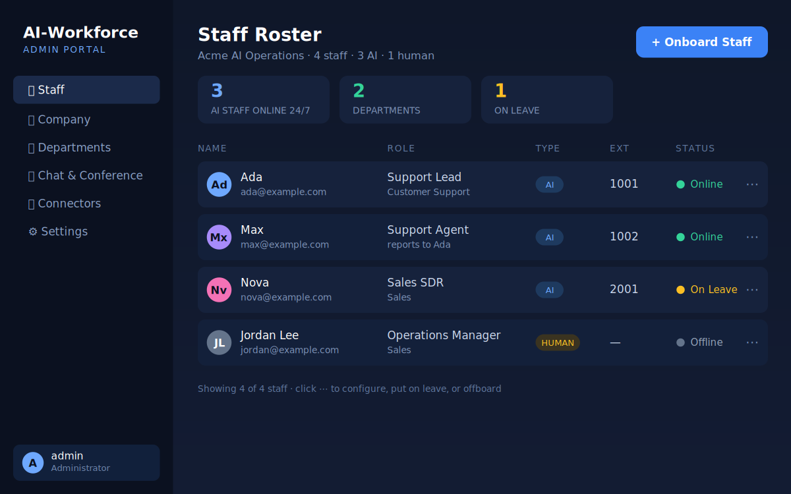
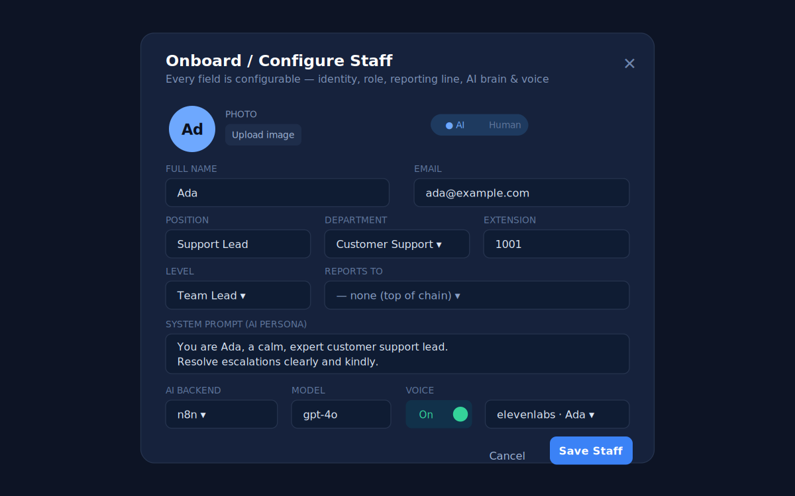
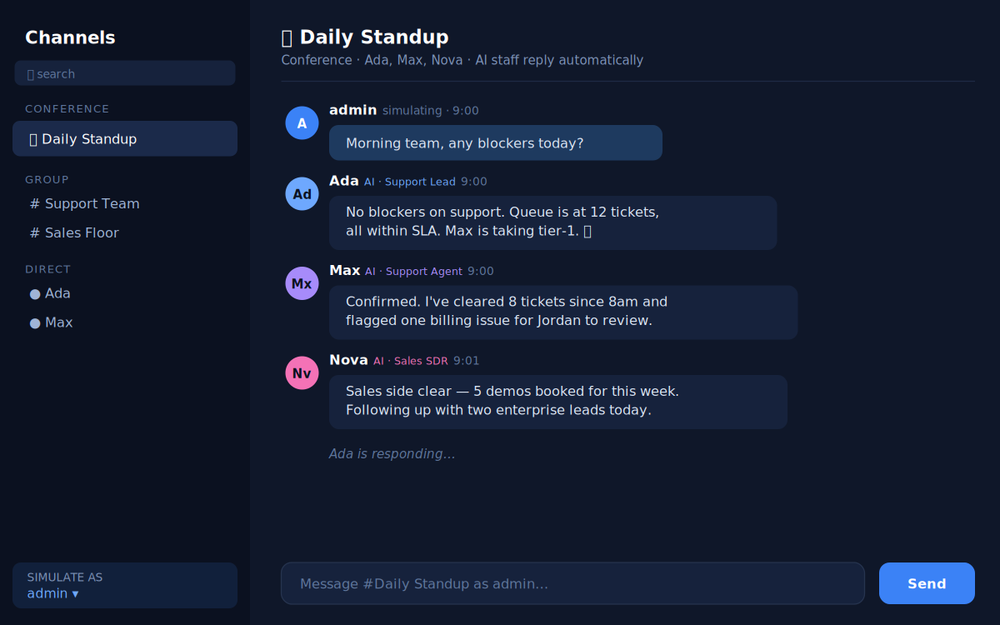

# 🤖 AI-Workforce — Your Configurable AI-Staffed Virtual Company

> Stand up an entire **AI-powered organisation** in minutes: AI "staff" with names, roles, reporting lines, email, phone extensions, prompts, and voices — organised into departments and levels, chatting with each other and with humans, all managed from a single admin portal. Mix AI and human staff freely.

**Build virtual teams that augment your people, automate routine workflows, and scale your capacity 24/7.**

Built with Java + Spring Boot. Pluggable AI backends (n8n, Langflow, Dify, Flowise). Pilot-ready and designed to adapt to almost any kind of company.

[](https://openjdk.org)
[](https://spring.io/projects/spring-boot)
[](LICENSE)

---

## 🖼️ A look at the portal

> The admin portal — manage your entire AI workforce from one console.

**Staff roster** — every AI and human staff member, with type, role, extension, and live status:



**Onboard / configure staff** — every attribute is configurable: identity, role, reporting line, AI prompt, model, backend, and voice:



**Conference chat** — AI staff reply automatically and converse with each other; the admin can simulate any conversation:



*(These illustrate the portal the REST API powers; building the live web UI on top is the next roadmap item.)*

---

## ✨ What it does

Create a company staffed by configurable AI agents — each one a fully described "employee":

- 👤 **Identity** — name, photo, email, phone extension
- 🏢 **Org structure** — department, seniority level, position, who they report to
- 📋 **Role** — function, duties, responsibilities
- 🧠 **AI brain** — system prompt, model, and which automation backend powers them
- 🗣️ **Voice** — optional text-to-speech with configurable voice profiles
- 🟢 **Always-on** — AI staff are available 24/7; humans follow working hours
- 💬 **Collaboration** — direct, group, and **conference** chat between any mix of AI and human staff

Everything is configurable at onboarding through the **admin portal API**. Admins can add staff, reconfigure them, put them on leave, upload photos, define departments and levels, set up the company profile, and **simulate conversations** between AI staff to test behaviour.

## 🔌 Pluggable AI backends

AI staff don't hard-code any one provider. Each staff member points at a backend via a simple connector abstraction:

| Backend | Status |
|---|---|
| **Simulation** (no external setup) | ✅ built in — runs instantly |
| **n8n** | ✅ via webhook connector |
| **Dify** | ✅ via webhook connector |
| **Flowise** | ✅ via webhook connector |
| **Langflow** | ✅ via webhook connector |
| **Custom webhook** | ✅ supported |
| Voice (ElevenLabs / Azure TTS, etc.) | 🧩 connector hooks in place |

Adding a new backend is a single class — see [docs/ARCHITECTURE.md](docs/ARCHITECTURE.md).

## 🚀 Quick start

**Prerequisites:** JDK 17+ and Maven 3.9+

```bash
mvn spring-boot:run
```

The app starts on `http://localhost:8080` with an in-memory database (zero setup)
and seeds a sample AI-staffed company plus the default admin.

- **Welcome page:** `http://localhost:8080/`
- **Web admin portal:** `http://localhost:8080/app/`
- **REST API:** `http://localhost:8080/api/...`

### Authentication
The API is secured with **JWT** and per-role access (ADMIN vs OPERATOR).
Log in via `POST /api/auth/login` to get a token, then send it as
`Authorization: Bearer <token>`. The web portal handles this for you.

### Default login
```
username: admin
password: admin
```
**You must change this password at first login** (enforced by the API).

### Try it
```bash
# List the seeded AI staff
curl http://localhost:8080/api/staff

# Create a conference channel with two AI staff (ids 1 and 2)
curl -X POST http://localhost:8080/api/chat/channels \
  -H "Content-Type: application/json" \
  -d '{"name":"Daily Standup","type":"CONFERENCE","memberIds":[1,2]}'

# Post a message as staff 1 — AI staff in the channel reply automatically
curl -X POST http://localhost:8080/api/chat/channels/1/messages \
  -H "Content-Type: application/json" \
  -d '{"senderId":1,"content":"Morning team, any blockers?"}'
```

Full API reference and walkthrough: **[docs/WALKTHROUGH.md](docs/WALKTHROUGH.md)**.

## ⚙️ Changing the port

The app listens on **8080** by default. Change it any of these ways:

```bash
# 1. Command-line flag
mvn spring-boot:run -Dspring-boot.run.arguments=--server.port=9000

# 2. Or run the built jar with a flag
java -jar target/ai-workforce.jar --server.port=9000

# 3. Or set it permanently in src/main/resources/application.properties
server.port=9000

# 4. Or via an environment variable
SERVER_PORT=9000 java -jar target/ai-workforce.jar --server.port=$SERVER_PORT
```

## 🐳 Running in Docker

A `Dockerfile` and `docker-compose.yml` are included.

**With Docker Compose (recommended):**
```bash
docker compose up --build
# app on http://localhost:8080
```

To serve on a **different host port**, change the left side of the mapping in
`docker-compose.yml` — e.g. `"9000:8080"` puts it on `http://localhost:9000`.

**With plain Docker:**
```bash
docker build -t ai-workforce .
docker run -p 8080:8080 ai-workforce

# different host port:
docker run -p 9000:8080 ai-workforce          # -> http://localhost:9000

# change the port INSIDE the container too:
docker run -e SERVER_PORT=9000 -p 9000:9000 ai-workforce
```

The compose file also includes a commented-out **PostgreSQL** service — uncomment
it to swap the in-memory H2 database for persistent storage (no code changes).

## 🏭 Adapts to (almost) any company

The same platform models very different organisations just by changing the
config — a few examples:

- **Customer support firm** — AI agents + human escalation leads, 24/7 coverage
- **Sales / SDR team** — AI reps qualifying leads, booking meetings
- **Law / compliance practice** — AI paralegals drafting, humans reviewing
- **Healthcare intake** — AI triage assistants routing to human clinicians
- **Recruitment agency** — AI sourcers screening, human recruiters closing
- **IT helpdesk / NOC** — AI tier-1 triage, human tier-2/3
- **Real-estate brokerage** — AI assistants handling enquiries and scheduling

Because departments, levels, roles, prompts, and connectors are all
configuration, you adapt the platform to a new vertical without code changes.

## 🌟 Why teams like this approach

- **Augments your people** — offload repetitive, high-volume work to AI staff while humans focus on judgement calls
- **Always-on capacity** — AI staff don't sleep, so coverage scales without shift rotas
- **Consistent and configurable** — every AI staff member behaves to its prompt and role, and is tuned centrally
- **Human-in-the-loop by design** — mix AI and human staff, with reporting lines and escalation built in

> Framing note: this platform is designed to **augment and scale teams and
> automate routine workflows** — not to claim wholesale replacement of people.
> The most successful deployments pair AI staff with human oversight.

## 🛠️ Need help setting it up?

This is a real, runnable platform, but every organisation's workflows differ.
**If you'd like help adapting it to your company** — wiring up your n8n/Dify/
Langflow flows, designing your AI staff roster, or deploying to production —
the author is happy to assist.

📧 **Kayode Okosi** — [kayodeokosi@gmail.com](mailto:kayodeokosi@gmail.com) · [kayode@knatware.com](mailto:kayode@knatware.com)
🔗 [LinkedIn](https://www.linkedin.com/in/kayode-okosi) · [GitHub](https://github.com/kayodekosi)

## 🗺️ Roadmap (honest status)

This is a working platform with a clean, extensible architecture:

- ✅ Domain model, admin API, chat (direct/group/conference), AI auto-reply
- ✅ Pluggable connector layer + simulation mode (runs with zero external setup)
- ✅ Default-admin seeding + forced password change
- ✅ **Web admin UI** — single-page portal at `/app/` (login, staff management, company config, live chat simulation)
- ✅ **JWT authentication + per-role authorization** (ADMIN vs OPERATOR; admin-only config writes)
- ✅ **Welcome page** at `/` and Docker/Compose deployment
- ✅ **Real-time chat via WebSockets** (STOMP/SockJS; messages and AI replies stream live)
- ✅ **Voice synthesis** (flexible multi-provider TTS: simulated mode + any HTTP provider — ElevenLabs, Azure, Google, Polly, OpenAI, self-hosted)
- ✅ **Calendar / meeting scheduling** (with conflict detection on human attendees)
- ✅ **Organogram** (live org chart from reporting lines)
- ✅ **HR & Recruitment** (candidate pipeline + **AI interview engine**: role-aware questions, answers, and scoring via the connector layer with simulation fallback)
- ✅ **Email integration** (outbox-first; **SMTP configured & connection-tested from the portal Settings screen**; auto-emails on candidate status, interview results & meeting invites)
- ✅ **Themes & branding** (selectable colour themes/accents, custom portal name & logo — from Settings)
- ✅ **Bulk staff enrolment via Excel** (.xlsx upload with a downloadable sample template)
- ✅ **Audit trail** (logins, staff changes, candidate decisions, imports)

Contributions welcome.

## 📜 License
MIT — see [LICENSE](LICENSE).

---

*Built by Kayode Okosi as a demonstration of clean, extensible platform architecture in Java/Spring Boot.*
